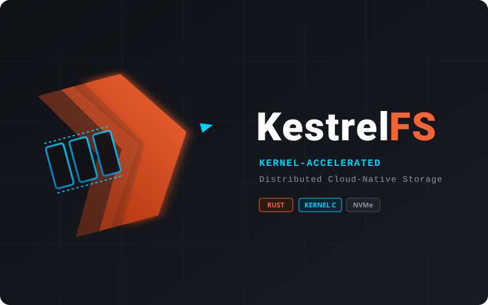

<p align="center">
  <a href="https://github.com/KestrelFS/KestrelFS">
    
  </a>
</p>

<p align="center">
  <strong>超高性能、内核级加速的云原生分布式文件系统</strong>
</p>

<p align="center">
  <a href="https://github.com/KestrelFS/KestrelFS/actions"></a>
  <a href="https://github.com/KestrelFS/KestrelFS"></a>
  <a href="https://github.com/KestrelFS/KestrelFS/blob/main/LICENSE"></a>
</p>

---

**A high-performance, cloud-native distributed filesystem — built with a pragmatic C + Rust hybrid architecture, engineered to outperform JuiceFS.**

> ⚠️ **Project status: early development (Phase 4 Step 24; ABI v11).**
> Phase 1–3 are done. Phase 3 provides a working control-plane prototype
> (dynamic VFS ops, 16 KiB bounce-buffer data/name IPC, `FileMetaStore`, an
> optional Redis metadata prototype, `LocalFsObjectStore`, and an optional
> S3/MinIO object prototype). Phase 4 now persists/restores a 4 KiB block index,
> fills successful READ_DATA misses, serves synchronous kernel BIO cache hits,
> invalidates rewrite/truncate/unlink/rename-overwrite mutations, and binds the
> cache format to an explicit namespace SHA-256 identity. Step 22 sends aligned,
> contiguous read hits directly into pinned user pages, while partial/unaligned
> ranges safely retain the buffered fallback. Step 23 adds block-LRU slot
> recycling when the cache is full. Step 24's v3 cache format validates every
> 4 KiB data block and index entry with CRC32 before accepting a hit. Journaling,
> asynchronous DMA, and multi-node invalidation are not implemented. See
> [Roadmap](#roadmap) and `HANDOFF.md`.

---

## Table of Contents

- [Vision](#vision)
- [Architecture](#architecture)
- [Roadmap](#roadmap)
- [Repository Layout](#repository-layout)
- [Requirements](#requirements)
- [Building](#building)
- [Usage](#usage)
- [Verifying the Build](#verifying-the-build)
- [Design Notes](#design-notes)
- [Contributing](#contributing)
- [License](#license)

---

## Vision

KestrelFS aims to be a distributed, POSIX-compatible cloud filesystem that
combines:

- **Kernel-level zero-copy I/O** for local NVMe cache hits — no context
  switch to userspace on the hot path.
- **Object-storage-backed durability** (S3-compatible backends) for cold
  data, with chunk/block-level deduplication and streaming upload/download.
- **Strongly consistent POSIX metadata**, backed by Redis/TiKV, served from
  a userspace control plane that can scale independently of the kernel data
  plane.

The explicit design goal is to **beat JuiceFS on cache-hit latency and
throughput** by moving the fast path (local cache read) entirely into the
kernel, while keeping all the complex, rapidly-iterating business logic
(metadata, chunking, S3 I/O) in a safe, memory-safe userspace daemon written
in Rust.

---

## Architecture

KestrelFS deliberately separates **control plane** and **data plane** across
a language and privilege boundary:

```
                         ┌─────────────────────────────┐
                         │      Userspace (Rust)        │
                         │                               │
                         │   KestrelFS Control-Plane     │
                         │   Daemon (Tokio async)        │
                         │                               │
                         │  • POSIX metadata (Redis/TiKV)│
                         │  • Chunk/Block slicing         │
                         │  • S3 SDK (object storage I/O) │
                         └───────────────▲───────────────┘
                                         │ mmap() shared ring buffers
                                         │ + ioctl()/poll() signalling
                         ┌───────────────▼───────────────┐
                         │      Kernel space (C)          │
                         │                                 │
                         │   KestrelFS Kernel Module       │
                         │                                 │
                         │  • VFS registration (super/inode/file) │
                         │  • /dev/kestrel_ctl char device  │
                         │  • Persistent local NVMe cache    │
                         │  • Pinned-page cache reads         │
                         └─────────────────────────────────┘
```

**Data plane (kernel, C).** An out-of-tree Linux kernel module that:
- Registers a VFS filesystem type and implements the inode/dentry/file
  operations needed to mount and serve files.
- Owns the local NVMe SSD cache boundary. Steps 20–24 restore/persist its fixed
  block index, fill READ_DATA misses, reject namespace identity mismatches, and
  send eligible aligned cache hits directly into pinned user pages; full caches
  recycle block slots with an in-memory LRU, while v3 data/index CRCs reject
  corrupt hits — see
  [`docs/phase4-nvme-cache.md`](docs/phase4-nvme-cache.md).
- Talks to the Rust daemon only when necessary (cache miss, metadata
  lookup) via a lock-free shared-memory IPC bridge.

**Control plane (userspace, Rust).** An async daemon (Tokio) that:
- Owns all POSIX metadata semantics, backed by Redis/TiKV.
- Performs chunk/block slicing of file data.
- Talks to S3-compatible object storage via the AWS SDK for Rust.
- Never blocks the kernel — all slow I/O (network, disk) happens off the
  VFS call path.

**The bridge.** Kernel and Rust communicate through a `/dev/kestrel_ctl`
character device: the kernel allocates a single `mmap()`-able shared memory
region containing **two independent lock-free SPSC ring buffers** (request
and response), avoiding any data copy through the socket/Netlink layer. Every
cross-language structure is defined once, in a dual-purpose C header
(`kestrelfs_ipc.h`) consumable by both the kernel module and `bindgen` on the
Rust side, so the ABI can never silently drift between the two
implementations. See [Design Notes](#design-notes) for the full memory
layout and synchronization model.

---

## Roadmap

Development proceeds in four strictly sequential phases. **Do not assume any
phase beyond what's marked "done" below is implemented.**

| Phase | Goal | Status |
|---|---|---|
| **1. Minimal C kernel VFS skeleton** | Out-of-tree module, VFS registration, super/inode/file ops. | ✅ Done |
| **2. C↔Rust IPC bridge** | `/dev/kestrel_ctl`, mmap dual SPSC rings, poll/ioctl, Rust daemon consumer. | ✅ Done |
| **3. Rust daemon control plane** | MetaStore + ObjectStore, dynamic VFS operations, bounce-buffer I/O, symlink, truncate, GC, local persistence, optional RedisMetaStore and S3ObjectStore prototypes (ABI v11 / Steps 1–17). | ✅ Prototype complete |
| **4. Kernel-owned NVMe cache** | Direct I/O against a local NVMe block device from kernel space. Cache hits bypass the Rust daemon. | 🚧 Step 24 — data/index CRC32 prototype (v3 format) |

See `HANDOFF.md` for step-level progress, opcodes, and known limitations.

---

## Repository Layout

```
KestrelFS/   # local checkout directory may historically be named FerroFS
├── LICENSE / README.md / HANDOFF.md
├── kestrelfs/                 # kernel module (C) — out-of-tree build
│   ├── Makefile, super.c, inode.c, dir.c, file.c, cache.c
│   ├── chardev.c, ipc_ring.c
│   ├── kestrelfs.h, kestrelfs_ipc.h   # ★ ABI contract (ABI v11)
│   └── chardev_test.c
├── docs/phase4-nvme-cache.md # Phase 4 ownership/index/invalidation design
├── test-step19-cache-vng.sh # loop format/reuse/fail-closed regression
├── test-step20-cache-vng.sh # loop fill/reload/hit/invalidation regression
├── test-step22-cache-vng.sh # pinned-page hit/copy fallback/A-B regression
├── test-step22-cache-io.c   # aligned read verifier used by Step 22 vng test
├── test-step23-eviction-vng.sh # small-cache LRU/reload regression
├── test-step24-checksum-vng.sh # data/index corruption and v2 rejection regression
└── daemon/                    # Rust control-plane daemon
    └── src/{main,abi,meta,meta_persist,meta_redis,object_store,object_store_s3,fs_model,device,ring,ioctl}.rs
```

---

## Requirements

- **Linux kernel 5.x/6.x** with matching headers installed for your running
  kernel (`/lib/modules/$(uname -r)/build` must exist).
  - Debian/Ubuntu: `sudo apt install linux-headers-$(uname -r)`
- **GCC** and standard kernel build tooling (`make`, `bc`, `flex`, `bison` —
  usually already present if headers are installed).
- **Root privileges** for `insmod`/`rmmod`/`mount` (module loading is a
  privileged operation on any stock kernel).
- (Later phases) **Rust toolchain** (stable, via `rustup`) and `bindgen` for
  the control-plane daemon.

> KestrelFS never builds against a full kernel source tree and never runs a
> whole-kernel `make -j`. All builds are strictly out-of-tree, driven by
> `make -C $(KDIR) M=$(PWD) modules`.

---

## Building

```bash
cd kestrelfs
make
```

This produces `kestrelfs.ko` by invoking kbuild against your currently
running kernel's headers:

```
make -C /lib/modules/$(uname -r)/build M=$(pwd) modules
```

To build against a different kernel's headers, override `KDIR`:

```bash
make KDIR=/lib/modules/<other-version>/build
```

Clean build artifacts:

```bash
make clean
```

---

## Usage

### Load the module and mount

```bash
cd kestrelfs
make
sudo insmod kestrelfs.ko
sudo mkdir -p /mnt/kestrelfs
sudo mount -t kestrelfs none /mnt/kestrelfs
```

### Read the sample file

```bash
cat /mnt/kestrelfs/hello.txt
# Hello from KestrelFS Kernel Module (Phase 1)!
```

The mount is intentionally **read-only** in Phase 1 — write attempts fail
with `EROFS`/`EACCES` by design; there is no on-disk or object-storage
backing yet.

### Unmount and unload

```bash
sudo umount /mnt/kestrelfs
sudo rmmod kestrelfs
```

### Inspect the IPC char device

Loading the module also registers `/dev/kestrel_ctl`, the Phase 2 IPC bridge
to the (not-yet-implemented) Rust daemon:

```bash
ls -l /dev/kestrel_ctl
```

A standalone smoke test exercises the chardev's `open`/`ioctl`/`mmap`/`poll`
surface without requiring the Rust daemon:

```bash
gcc -O2 -Wall -I kestrelfs -o kestrelfs/chardev_test kestrelfs/chardev_test.c
sudo kestrelfs/chardev_test
```

Expected output includes ABI version / shared-region-size confirmation and a
successful `mmap()` of the ring-buffer region — see
[Verifying the Build](#verifying-the-build) for the full expected transcript.

### Start the control-plane daemon (Phase 3+)

Starting from Phase 3, the daemon handles block storage and metadata operations.
Build and run the daemon:

```bash
cd daemon
cargo build --release
sudo ./target/release/kestrelfs-daemon --data-dir /var/lib/kestrelfs/objects
```

**Command-line options:**

- `--data-dir <PATH>` — Directory for persistent metadata (`meta.json`) and block
  objects (default: `./.kestrelfs-data`)
  - Blocks and metadata persist across daemon restarts
  - Must be writable by the daemon process (requires `sudo` if using system paths)

- `--memory` — Use in-memory MetaStore + ObjectStore (data lost on restart; tests only)

- `--meta <REDIS_URL>` — Use Redis metadata instead of `meta.json`, for example
  `redis://127.0.0.1:6379/0`. Block objects still use `--data-dir`.

- `--redis-prefix <PREFIX>` — Namespace for the Redis snapshot key (default:
  `kestrelfs`; actual key: `<PREFIX>:meta:v1`). This option requires `--meta`.

- `--objects <S3_URL>` — Use S3-compatible object storage instead of
  `--data-dir`, for example `s3://bucket/kestrelfs-data`. This conflicts with
  `--memory` and can be combined with either FileMetaStore or RedisMetaStore.

- `--s3-endpoint <URL>` — Custom endpoint for MinIO or another compatible
  service. Custom endpoints automatically use path-style addressing. If this
  flag is omitted, `S3_ENDPOINT` is checked before the normal AWS endpoint.

S3 credentials and region use the standard AWS SDK provider chain, including
`AWS_ACCESS_KEY_ID`, `AWS_SECRET_ACCESS_KEY`, optional `AWS_SESSION_TOKEN`, and
`AWS_REGION`. Credentials are never accepted as CLI flags or printed by the
daemon. The target bucket must already exist during normal daemon startup.

The Redis backend stores one JSON metadata snapshot and atomically replaces it
with a Lua compare-and-swap. This preserves cross-structure rename/truncate/GC
semantics, but transfers the full snapshot on each operation and is intended as
a correctness prototype. A real-Redis integration test is opt-in:

```bash
cd daemon
REDIS_URL=redis://127.0.0.1:6379/15 \
  cargo test redis_url_gated_full_semantics_and_restart -- --nocapture
```

The S3 integration tests are likewise opt-in and use a random object prefix:

```bash
S3_ENDPOINT=http://127.0.0.1:9000 S3_BUCKET=kestrelfs-test \
AWS_ACCESS_KEY_ID=minioadmin AWS_SECRET_ACCESS_KEY=minioadmin \
AWS_REGION=us-east-1 cargo test s3_environment_gated -- --nocapture
```

**Verifying persistence:**

1. Start daemon with a data directory:
   ```bash
   sudo ./target/release/kestrelfs-daemon --data-dir /tmp/kestrelfs-data
   ```

2. Write data to the filesystem:
   ```bash
   echo "persistent data" > /mnt/kestrelfs/writable.dat
   cat /mnt/kestrelfs/writable.dat  # Should show: persistent data
   ```

3. Stop the daemon (Ctrl+C) and restart it with the same `--data-dir`:
   ```bash
   sudo ./target/release/kestrelfs-daemon --data-dir /tmp/kestrelfs-data
   ```

4. Verify data persists:
   ```bash
   cat /mnt/kestrelfs/writable.dat  # Should still show: persistent data
   ```

The daemon must be running before accessing files that require IPC operations
(`remote.txt`, `writable.dat`). Static files like `hello.txt` work without the daemon.

---

## Verifying the Build

A full manual verification pass, useful after any change to `kestrelfs/`:

```bash
# 1. Build
cd kestrelfs && make

# 2. Load
sudo insmod kestrelfs.ko
lsmod | grep kestrelfs
cat /proc/filesystems | grep kestrelfs
dmesg | tail -5      # expect: "filesystem + chardev registered"

# 3. Mount and read
sudo mkdir -p /mnt/kestrelfs
sudo mount -t kestrelfs none /mnt/kestrelfs
ls -la /mnt/kestrelfs
cat /mnt/kestrelfs/hello.txt

# 4. Confirm read-only enforcement
echo test > /mnt/kestrelfs/hello.txt   # expect: Permission denied
touch /mnt/kestrelfs/new_file           # expect: Read-only file system

# 5. Exercise the chardev bridge
gcc -O2 -Wall -I . -o chardev_test chardev_test.c
sudo ./chardev_test                     # expect "[PASS] all chardev infrastructure checks succeeded"
dmesg | tail -5                          # expect: shared region allocated (~147648 bytes, 1024 slots/ring + 16 KiB bounce)

# 6. Unmount and unload cleanly
sudo umount /mnt/kestrelfs
sudo rmmod kestrelfs
dmesg | tail -5      # expect: "unloaded, filesystem + chardev unregistered", no WARNING/Oops/BUG
lsmod | grep kestrelfs   # expect: no output
```

Any `WARNING:`, `Oops:`, or `BUG:` line in `dmesg` at any point indicates a
regression and should block a change from landing.

---

## Design Notes

### Kernel↔Rust IPC contract

The shared memory region (`struct kestrelfs_shared_region` in
`kestrelfs_ipc.h`) is laid out as:

```
offset 0       : header (magic, abi_version, padding)      — 64 B
offset 64      : req_ctrl  (head/tail/capacity)            — 64 B (own cacheline)
offset 128     : resp_ctrl (head/tail/capacity)            — 64 B (own cacheline)
offset 192     : req_slots[1024]   (kernel -> Rust)        — 64 KiB
offset 65728   : resp_slots[1024]  (Rust -> kernel)        — 64 KiB
offset 131264  : data_buffer (ABI v8+ bounce for bulk I/O  — 16 KiB
                 and long names)
                                         total: 147648 B (~144 KiB)
```
Exact sizes are asserted in `kestrelfs_ipc.h` / `daemon/src/abi.rs`
(`KESTRELFS_SHM_REGION_SIZE` / `SHM_REGION_SIZE`).

Each event slot is exactly 64 bytes (one cacheline): a sequence number,
opcode, flags, request ID (echoed back on the matching response), an error
code, and a 32-byte opcode-specific payload. Ring control blocks are
cacheline-aligned and physically separated from each other to avoid false
sharing between producer and consumer indices.

All fields use fixed-width types (`__u32`/`__u64`/...) from
`<linux/types.h>`, with explicit padding and natural alignment (no packed
structs) so the Rust side's `#[repr(C)]` mirror is byte-identical without
needing `#[repr(packed)]`. Every structural invariant is enforced at compile
time via `_Static_assert`, checked under both kernel-C and plain userspace
GCC.

**Wakeup model** (no busy-spinning):
- **Kernel → Rust**: after pushing into the request ring, the kernel calls
  `wake_up_interruptible()` on an internal wait queue, waking any Rust
  thread parked in `poll()`/`epoll_wait()` on `/dev/kestrel_ctl`.
- **Rust → Kernel**: after pushing into the response ring, Rust issues the
  `KESTRELFS_IOC_NOTIFY_RESP` ioctl, which the kernel driver turns into
  `wake_up_all()` on the wait queue backing any kernel thread blocked on a
  pending response.

See the extensive comments at the top of `kestrelfs/kestrelfs_ipc.h` for the
full protocol rationale, and `kestrelfs/chardev.c` for the allocation
(`vmalloc_user()`) and mapping (`remap_vmalloc_range()`) strategy.

### Opcode payload layouts (metadata operations)

`KESTRELFS_OP_LOOKUP` and `KESTRELFS_OP_GETATTR` each define a fixed,
little-endian byte layout within the 32-byte payload (see
`kestrelfs_ipc.h` for the authoritative, byte-offset-by-byte-offset
documentation and matching `_Static_assert`s): `LOOKUP` requests carry
`parent_inode(u64)` + `name_len(u8)` + up to 23 bytes of `name`;
`LOOKUP`/`GETATTR` success responses each pack a different, fully
payload-filling set of attribute fields (`child_inode_id`/`size`/`mode`/
`uid`/`gid`/`nlink` for `LOOKUP`; `size`/`mode`/`uid`/`gid`/`nlink`/`mtime`
for `GETATTR`, trading the repeated inode id for an `mtime` field since the
requester already supplied that id and matches the response via `req_id`).
Failures never use the payload - they are always carried in the event
header's `error_code` field. This did not require an `KESTRELFS_ABI_VERSION`
bump: it only adds interpretation rules for previously-reserved payload
bytes of two opcodes that had no producer/consumer code on either side yet,
without changing any existing struct's size, alignment, or field offsets.

### Known Limitations

The Phase 3 stack supports create/mkdir/unlink/rmdir/rename/symlink,
read/write (16 KiB bounce), truncate/`O_TRUNC`, and batched readdir with
255-byte names (ABI v11). Remaining gaps include:

- **No hard link** yet; symlink targets currently require UTF-8 and are capped at 4095 bytes.
- **GC delete failures can leak objects**: namespace metadata commits first for safety;
  failed best-effort deletes are logged, but there is not yet a durable retry queue.
- **Data/name IPC is globally serialized** by one mutex (correct but limits
  concurrency).
- **Redis metadata is currently a single-key/full-snapshot prototype**, not a
  scalable per-inode schema. S3 delete failures can still leak objects because
  GC has no durable retry queue.
- **Phase 4 remains a single-node prototype**: v3 binds a persistent 4 KiB
  block index to one namespace; miss/fill and mutation invalidation work, and
  Step 22 can BIO aligned contiguous hits into pinned user pages, while Step 23
  recycles full-cache slots using a block LRU. Step 24 validates full 4 KiB data
  blocks and index entries using CRC32; corrupt data is retired as a local miss,
  while corrupt index identity fails device loading closed. Partial or
  unaligned ranges still use a temporary kernel block plus `copy_to_user()`.
  Runtime access recency is not persisted across reload; CRC32 is not
  cryptographic, and there is no journal/superblock mirror, asynchronous DMA
  pipeline, or remote multi-node invalidation.

Authoritative detail lives in `HANDOFF.md` §6.

### Coding standards

- Kernel C code strictly follows the Linux kernel coding style and is built
  exclusively out-of-tree — the kernel source tree itself is never modified
  or rebuilt.
- Kernel code is kept deliberately minimal, with defensive null/bounds
  checks everywhere a fault could otherwise panic the kernel; all non-trivial
  business logic is pushed to the Rust control plane.
- Any structure shared across the C/Rust boundary is defined once in a
  dual-purpose header and validated with compile-time layout assertions on
  both sides — cross-language memory layout is never taken on faith.

---

## Contributing

This project is under active, phase-gated development. Please open an issue
before starting work on anything beyond the current phase in the
[Roadmap](#roadmap) — out-of-order contributions are unlikely to be merged
until their prerequisite phase lands.

---

## License

Licensed under the [Apache License, Version 2.0](LICENSE).
